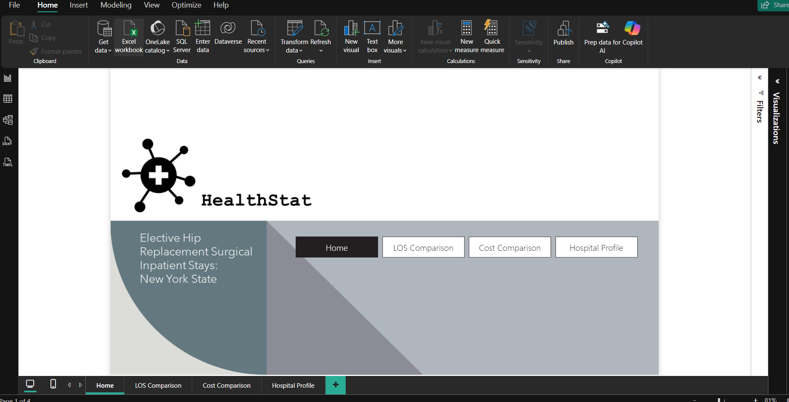
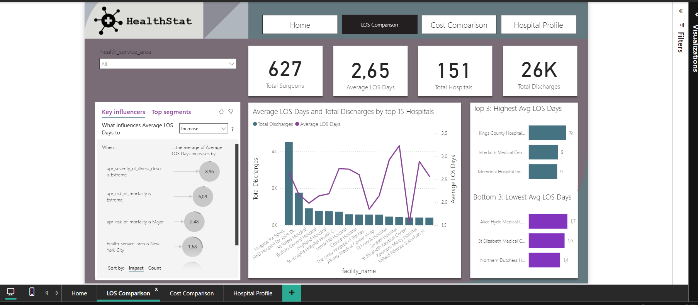
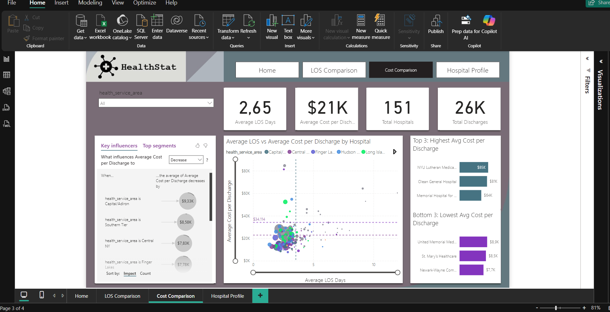
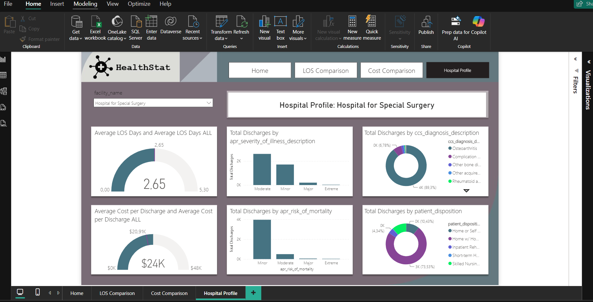

# 🏥 Healthcare Analysis with Power BI

An interactive **Power BI healthcare analytics dashboard** developed to analyze hospital efficiency for elective hip replacement procedures across New York State.

The project examines hospital performance using key healthcare metrics such as **Length of Stay (LOS), cost per discharge, total discharges, hospital volume, illness severity, mortality risk, diagnosis, and patient disposition**.

---

## 📌 Project Overview

HealthStat, a fictitious healthcare consulting organization, requires an analytical dashboard to identify potential opportunities for improving hospital efficiency.

The analysis focuses on **elective hip replacement inpatient stays** and uses Power BI to compare hospital performance and identify patterns affecting:

- Length of Stay (LOS)
- Cost per discharge
- Patient volume
- Hospital performance
- Illness severity
- Mortality risk
- Patient disposition

The objective is to transform hospital discharge data into an interactive decision-support dashboard that allows stakeholders to quickly identify differences in efficiency across hospitals.

---

## 🎯 Business Objective

The primary objective of this analysis is to evaluate hospital efficiency and answer questions such as:

- Which hospitals have the highest and lowest average Length of Stay?
- Which hospitals have the highest and lowest average cost per discharge?
- What factors influence Length of Stay?
- What factors influence treatment costs?
- How does hospital discharge volume vary between hospitals?
- How do illness severity and mortality risk affect hospital utilization?
- How do individual hospitals compare with the overall hospital population?

Reducing unnecessary Length of Stay can potentially lower treatment costs, increase hospital capacity, and improve patient throughput.

---

## 📊 Dataset

The dataset contains **2016 New York State hospital discharge records** for patients undergoing elective hip replacement procedures.

Each row represents an individual inpatient hospital stay/discharge.

Important attributes used in the analysis include:

| Field | Description |
|---|---|
| `facility_id` | Unique identifier for each hospital |
| `facility_name` | Hospital/facility name |
| `health_service_area` | Geographic healthcare service area |
| `length_of_stay` | Number of days a patient remained in hospital |
| `total_costs` | Total cost associated with the hospital stay |
| `age_group` | Patient age group |
| `patient_disposition` | Patient destination/status after discharge |
| `ccs_diagnosis_description` | Primary diagnosis associated with the stay |
| `apr_severity_of_illness_description` | Severity of patient illness |
| `apr_risk_of_mortality` | Patient mortality risk classification |

---

## 📈 Dashboard Pages

The Power BI report contains four interactive dashboard pages.

### 1. Home



The Home page acts as the landing page for the report and provides navigation to the main analytical sections:

- LOS Comparison
- Cost Comparison
- Hospital Profile

---

### 2. Length of Stay Comparison



This dashboard evaluates hospital performance based on **Average Length of Stay (LOS)**.

Key metrics include:

- **627 Total Surgeons**
- **2.65 Average LOS Days**
- **151 Hospitals**
- **~26K Total Discharges**

The page includes:

- Hospital LOS comparison
- Total discharge volume by hospital
- Top 3 hospitals with the highest average LOS
- Bottom 3 hospitals with the lowest average LOS
- Key Influencers analysis
- Health Service Area filtering

The Key Influencers visual helps identify factors associated with increasing Length of Stay, including illness severity, mortality risk, and healthcare service area.

---

### 3. Cost Comparison



The Cost Comparison dashboard analyzes differences in treatment costs between hospitals.

Important KPIs include:

- **2.65 Average LOS Days**
- **~$21K Average Cost per Discharge**
- **151 Hospitals**
- **~26K Total Discharges**

The dashboard contains:

- Average LOS vs. Average Cost per Discharge scatter plot
- Cost comparison between hospitals
- Top 3 highest-cost hospitals
- Bottom 3 lowest-cost hospitals
- Key Influencers for treatment cost
- Health Service Area segmentation

This view helps identify hospitals with unusual cost patterns and evaluate the relationship between hospital stay duration and treatment cost.

---

### 4. Hospital Profile



The Hospital Profile page enables detailed analysis of an individual hospital selected through the `facility_name` slicer.

The dashboard evaluates:

- Hospital Average LOS vs. overall Average LOS
- Hospital Average Cost vs. overall Average Cost
- Total discharges by illness severity
- Total discharges by mortality risk
- Total discharges by diagnosis
- Total discharges by patient disposition

This page allows stakeholders to compare an individual hospital against overall benchmarks and understand the composition of its patient population.

---

## 📐 Key Measures

Several DAX measures were developed to support the analysis, including:

```DAX
Total Hospitals =
DISTINCTCOUNT(hospital_discharges[facility_id])